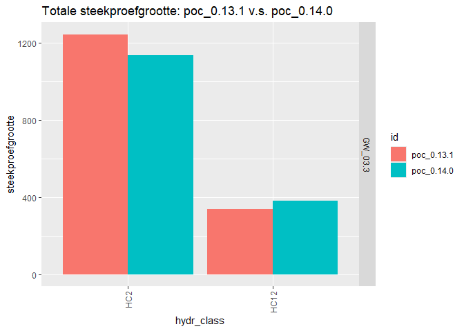
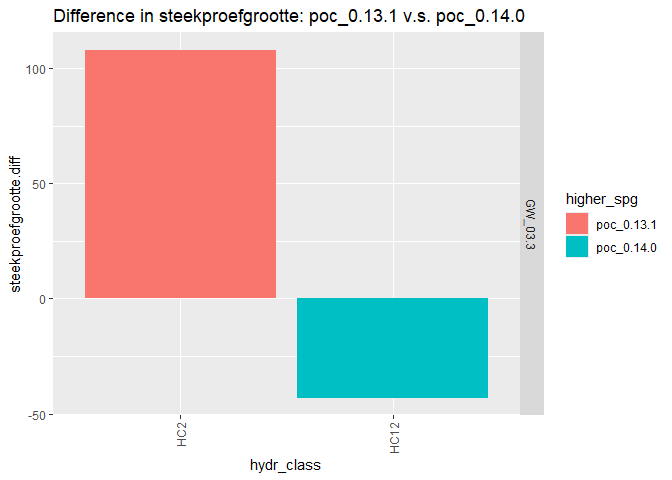
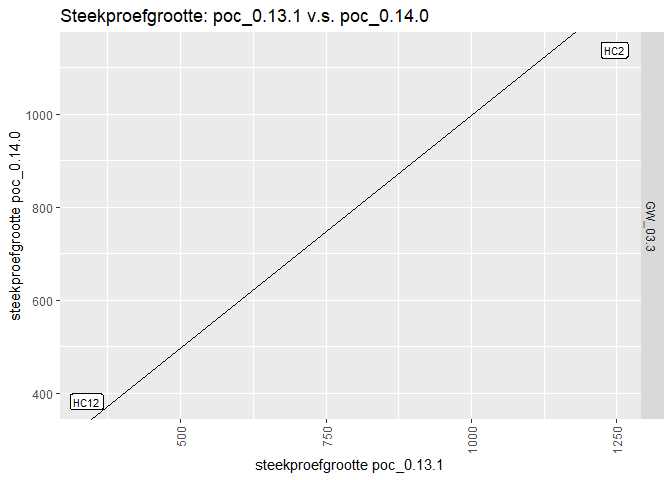

<!-- README.md is generated from README.Rmd. Please edit that file -->

# Exercise RES vacature MNM (INBO)

**NOTE: This is a toy package created for demonstration purposes ONLY
!**

- The name comes from the R-package function: to compare the **spg** or
  “SteekProefGrootte” (sample_size) for different datasets

# spg

<!-- badges: start -->

<!-- badges: end -->

The goal of spg is to demonstrate R skills in context of a vacature for
RES at team MNM (INBO)

- Load data from shared google drive
- manipulate and aggregate data into required measure (sample_size =
  “steekproefgrootte”)
- plot measure to compare datasets

## Installation

You can install the development version of spg from
[GitHub](https://github.com/) with:

``` r
# install.packages("pak")
pak::pak("nick-dil/MNM-RES-demo")
```

## Example

> ***NOTE:*** See the `examples/00_tutorial.R`

This is a basic example which shows you how to solve the exercise:

``` r
library(spg)
library(tidyverse)
#> ── Attaching core tidyverse packages ──────────────────────── tidyverse 2.0.0 ──
#> ✔ dplyr     1.1.4          ✔ readr     2.1.5     
#> ✔ forcats   1.0.0          ✔ stringr   1.5.1     
#> ✔ ggplot2   3.5.1          ✔ tibble    3.2.1     
#> ✔ lubridate 1.9.3.9000     ✔ tidyr     1.3.1     
#> ✔ purrr     1.0.2          
#> ── Conflicts ────────────────────────────────────────── tidyverse_conflicts() ──
#> ✖ dplyr::filter() masks stats::filter()
#> ✖ dplyr::lag()    masks stats::lag()
#> ℹ Use the conflicted package (<http://conflicted.r-lib.org/>) to force all conflicts to become errors

# Retrieve POC dir ids ~ version
poc_id_list = getPocIdList()
#> ! Using an auto-discovered, cached token.
#>   To suppress this message, modify your code or options to clearly consent to
#>   the use of a cached token.
#>   See gargle's "Non-interactive auth" vignette for more details:
#>   <https://gargle.r-lib.org/articles/non-interactive-auth.html>
#> ℹ The googledrive package is using a cached token for 'nick.dillen@inbo.be'.

# Read and create aggregated sample size ~ dataset, see exercise
demo.v131 = readPocSampleData(poc_id_list$poc_0.13.1) %>% 
  makeSpgTable() %>% wrangleSpgTable()
#> No encoding supplied: defaulting to UTF-8.
#> Loading required namespace: n2khab

demo.v140 = readPocSampleData(poc_id_list$poc_0.14.0) %>% 
  makeSpgTable() %>% wrangleSpgTable()
#> No encoding supplied: defaulting to UTF-8.
```

Inspect a dataset:

``` r
summary(demo.v140)
#>    meetnet          hydr_class      id            steekproefgrootte
#>  Length:2           HC1 :0     Length:2           Min.   : 382     
#>  Class :character   HC12:1     Class :character   1st Qu.: 571     
#>  Mode  :character   HC2 :1     Mode  :character   Median : 760     
#>                     HC23:0                        Mean   : 760     
#>                     HC3 :0                        3rd Qu.: 949     
#>                                                   Max.   :1138
```

And compare the sample_size between datasets with some exploratory
plots:

``` r

# Make comparison plots
demo_plots = plotSpgComparison(demo.v131, demo.v140)

demo_plots$spg_barplot
```



``` r
demo_plots$spg_diff_barplot
```



``` r
demo_plots$spg_scatter
```


